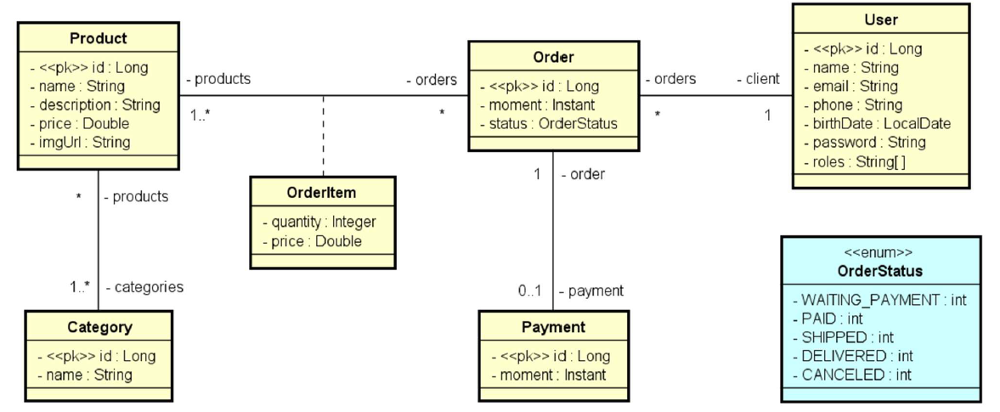
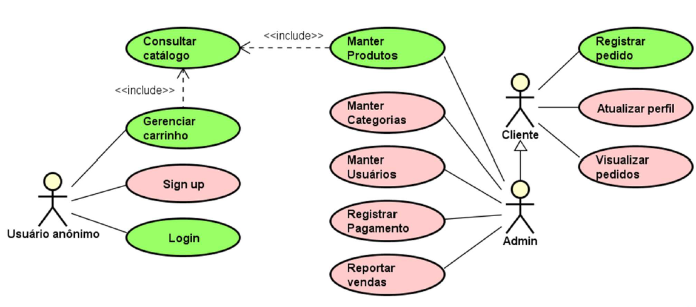

# DSCommerce

## Descrição

O **DSCommerce** é um sistema de comércio eletrônico desenvolvido para gerenciar usuários, produtos, categorias, carrinho de compras e pedidos.

O sistema possui diferentes níveis de acesso, permitindo que usuários anônimos naveguem pelo catálogo e gerenciem o carrinho, enquanto clientes autenticados podem realizar pedidos e consultar seu histórico. Usuários administradores possuem acesso às funcionalidades administrativas de produtos, categorias, usuários e relatórios.

## Funcionalidades

### Catálogo de produtos

- Listagem paginada de produtos;
- Filtro de produtos pelo nome;
- Visualização dos detalhes de um produto;
- Exibição de nome, imagem, preço e categorias.

A listagem do catálogo possui **12 produtos por página** e é ordenada pelo nome do produto.

### Gerenciamento de produtos

Usuários administradores podem:

- Cadastrar produtos;
- Atualizar produtos;
- Excluir produtos;
- Filtrar produtos pelo nome;
- Associar produtos a uma ou mais categorias.

Os produtos possuem nome, descrição, preço, imagem e categorias.

### Gerenciamento de categorias

Administradores podem realizar o CRUD de categorias, incluindo a possibilidade de filtrar categorias pelo nome.

### Gerenciamento de usuários

Administradores possuem acesso ao cadastro de usuários e podem realizar operações de gerenciamento e consulta.

### Autenticação

O sistema possui autenticação de usuários por meio de login.

Após informar credenciais válidas, o sistema retorna um **token de acesso**, permitindo que o usuário autenticado acesse as funcionalidades protegidas.

### Cadastro de usuários

Usuários não autenticados podem realizar seu cadastro no sistema.

Todo usuário cadastrado é considerado **cliente por padrão**.

### Carrinho de compras

Usuários podem:

- Adicionar produtos ao carrinho;
- Remover produtos;
- Incrementar a quantidade de um item;
- Decrementar a quantidade de um item;
- Consultar o valor total do carrinho.

Cada item do carrinho apresenta:

- ID do produto;
- Nome do produto;
- Preço;
- Quantidade;
- Subtotal.

### Registro de pedidos

Clientes autenticados podem registrar um pedido a partir dos produtos presentes no carrinho.

Para registrar um pedido:

- O usuário deve estar autenticado;
- O carrinho deve possuir pelo menos um item.

Após o registro, o pedido é salvo no sistema e o carrinho de compras é esvaziado.

### Pedidos

Um pedido possui:

- Instante de criação;
- Status;
- Cliente;
- Itens do pedido;
- Pagamento.

Os possíveis status de um pedido são:

- `WAITING_PAYMENT`
- `PAID`
- `SHIPPED`
- `DELIVERED`
- `CANCELED`

Quando um pagamento é realizado, o instante do pagamento também é registrado. 

### Relatórios

Administradores possuem acesso a relatórios de pedidos, podendo realizar filtros por data.

## Modelo de domínio

O sistema possui as seguintes entidades principais:

- `User`
- `Role`
- `Product`
- `Category`
- `Order`
- `OrderItem`
- `Payment`

Um produto pode estar associado a uma ou mais categorias e pode fazer parte de diferentes pedidos.

Cada `OrderItem` representa um produto dentro de um pedido, armazenando sua quantidade e o preço praticado no momento da venda. Dessa forma, alterações futuras no preço do produto não modificam o histórico dos pedidos já realizados.

## Perfis de acesso

O sistema possui três tipos de usuários:

| Perfil | Permissões |
|---|---|
| Usuário anônimo | Catálogo, carrinho, login e cadastro |
| Cliente | Dados pessoais, pedidos e funcionalidades públicas |
| Admin | Funcionalidades de cliente + área administrativa |

O administrador também possui acesso aos cadastros e relatórios do sistema.

## Casos de uso

O sistema possui os seguintes casos de uso principais:

| Caso de uso | Descrição | Acesso |
|---|---|---|
| Manter produtos | CRUD de produtos com filtro por nome | Admin |
| Manter categorias | CRUD de categorias com filtro por nome | Admin |
| Manter usuários | CRUD de usuários com filtro por nome | Admin |
| Gerenciar carrinho | Adicionar, remover e alterar quantidade de produtos | Público |
| Consultar catálogo | Listar e filtrar produtos | Público |
| Sign up | Cadastro de usuário | Público |
| Login | Autenticação do usuário | Público |
| Registrar pedido | Registrar pedido a partir do carrinho | Usuário logado |
| Atualizar perfil | Atualizar os próprios dados | Usuário logado |
| Visualizar pedidos | Consultar os próprios pedidos | Usuário logado |
| Registrar pagamento | Registrar pagamento de um pedido | Admin |
| Reportar pedidos | Gerar relatório de pedidos por data | Admin |

## Regras de validação

Para o cadastro e atualização de produtos, são aplicadas as seguintes regras:

- **Nome:** entre 3 e 80 caracteres;
- **Preço:** deve ser positivo;
- **Descrição:** deve possuir pelo menos 10 caracteres;
- **Categorias:** o produto deve possuir pelo menos uma categoria.

## Tecnologias

- Java
- Spring Boot
- Spring Data JPA
- Spring Security
- OAuth2 / JWT
- Banco de dados relacional
- Maven

## Referência

Projeto baseado no sistema **DSCommerce**, desenvolvido como material educacional da [DevSuperior](https://devsuperior.com.br).

---

**Todos os direitos reservados à DevSuperior.**